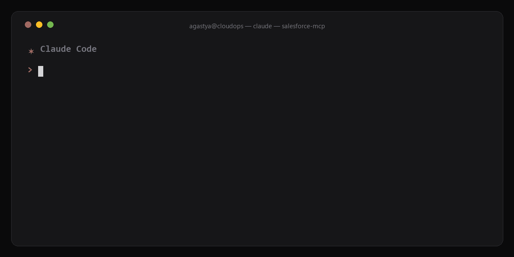
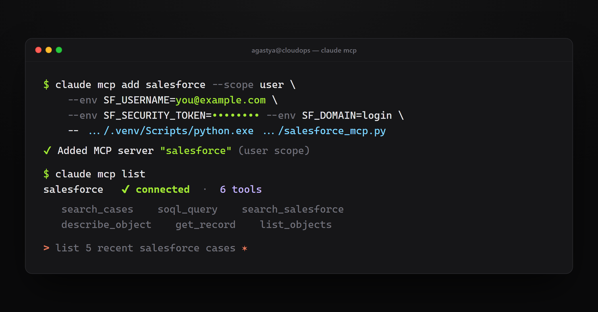
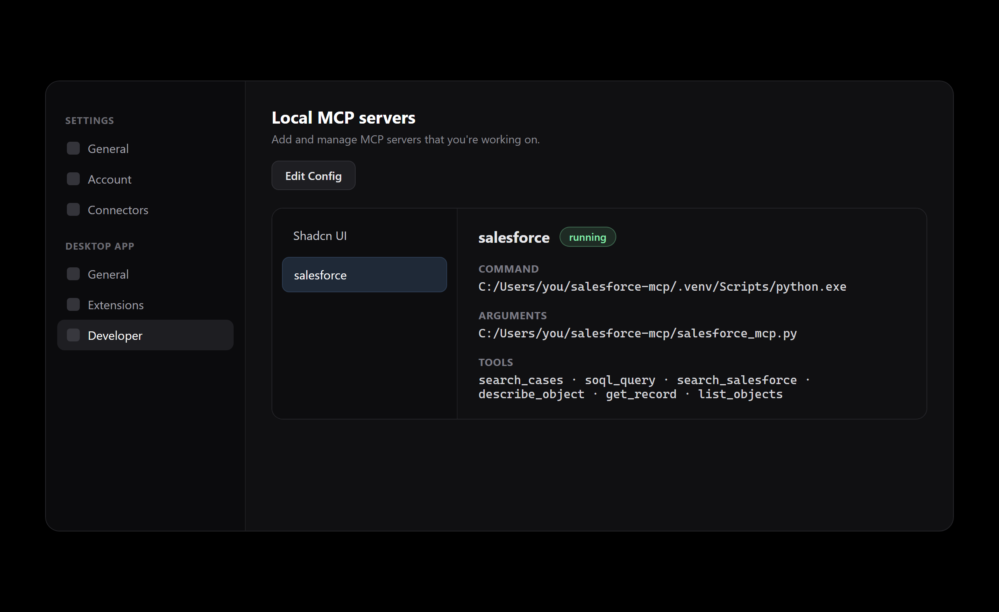

# Salesforce MCP Server

> Your Salesforce search bar gives up after the subject line. This doesn't.
> It reads the comments, the descriptions, and the five-year-old ticket your
> colleague swears they "definitely wrote it all down in" - across 1,000,000+
> cases - so you don't have to.

A read-only [Model Context Protocol](https://modelcontextprotocol.io) (MCP)
server that gives Claude structured, query-level access to a Salesforce org.
It runs locally, authenticates with a standard username + security token, and
exposes a small set of focused tools for querying, searching, and inspecting
Salesforce data from inside Claude Code or Claude Desktop.

<p align="center">
  
</p>
<p align="center"><sub>Real run over Polaris-migration cases: one <code>search_cases</code> call finds them across subject <em>and</em> comments — including the ones whose titles give no hint (<code>Need another Trial for ArgoData</code>).</sub></p>

---

## Why this exists

Salesforce holds the answer to most "has this happened before?" questions, but
finding it is the problem:

- The thing you are looking for is rarely in the **Subject**. It lives in the
  **Case Description**, the **Case Comments**, or an inbound **email body**.
- `Case.Description` is a long-text field and **cannot be filtered in SOQL** at
  all, so the obvious query silently misses it.
- The native search is keyword-shaped, returns a wall of links, and has no idea
  what "migration cases still open this week" means.

This server turns all of that into one instruction: *"find the cases about X."*
It searches every place the information could be hiding, merges the results,
tells you the true total, and flags the matches it is not sure about.

---

## What it does

- Runs **SOQL** queries and returns clean JSON (no Salesforce metadata noise).
- Runs **SOSL** full-text search across the whole org, grouped by object type.
- Describes any object's fields before you query it.
- Fetches a single record by Id.
- Lists the org's objects (with a substring filter, because there are ~1,700).
- Provides a dedicated **case topic search** that looks everywhere at once and
  reports honest coverage numbers.

Everything is **read-only**. The server queries, searches, and describes. It
never writes, updates, or deletes.

---

## Tools

| Tool | What it does |
|------|--------------|
| `search_cases(term, limit=20, exhaustive=False, owner="")` | Find Cases about a topic across **all** sources (Subject + Comments + full-text Description). Merges and dedupes, reports the true match count per source, and flags loose full-text-only hits. Pass `owner="Full Name"` to scope to one person's cases ("cases I handled"). The primary tool for "find the cases about X." |
| `soql_query(query, max_rows=2000)` | Run a SOQL query and return matching records as JSON. Returns the first page (~2,000 rows) by default; raise `max_rows` (up to 50,000) to paginate larger result sets. `complete` is false when more rows matched than were returned. |
| `search_salesforce(term)` | SOSL full-text search across every object. Returns matching record Ids **grouped by object type**; re-query the Ids with `soql_query` for fields. |
| `describe_object(name, refresh=False)` | Return an object's fields (API names, labels, types) so you can build a correct SOQL query. Cached per process; `refresh=True` bypasses it. |
| `get_record(object, id)` | Fetch all fields of one record by its 15- or 18-character Id. |
| `list_objects(name_filter="", refresh=False)` | List queryable objects. Pass a case-insensitive substring (e.g. `"case"`) to narrow the ~1,700-object list. Cached per process; `refresh=True` bypasses it. |

---

## The search-everywhere model (`search_cases`)

When you ask for cases about a topic, the term is usually **not** in the title.
`search_cases` runs three searches and reconciles them:

1. **Subject** - `Case.Subject LIKE '%term%'`
2. **Comments** - `CaseComment.CommentBody LIKE '%term%'` (high precision)
3. **Everything else** - SOSL `FIND {term} IN ALL FIELDS`, which is the only way
   to match text inside the un-filterable `Case.Description`.

It then:

- **Merges and dedupes** by case, recording which sources matched (`matched_in`).
- **Flags `loose_match`** when only the full-text search hit - those are the
  ones where your two words might appear in different paragraphs, so verify them.
- **Reports true totals** per source, so a result of "showing 200" never hides
  the fact that 8,000 cases actually match.
- Takes **`exhaustive=True`** to paginate and pull *every* matching case across
  the org's entire history, not just the most recent page.

### Coverage and limits, stated plainly

- The SOQL legs have **no date floor** - they reach the very first case in the
  org. Default mode fetches the newest ~200 per source; `exhaustive=True`
  fetches all of them.
- SOSL is **index-capped** (~2,000 total / ~200 per object) and matches terms
  loosely (words can appear separately). It is high-recall, not exhaustive, and
  never phrase-exact. The SOQL legs are what guarantee full-history coverage.

---

## Requirements

- Python 3.10 or newer.
- A Salesforce user with API access, and that user's **security token**.
- Claude Code (CLI) and/or Claude Desktop.

---

## Installation

```bash
git clone https://github.com/repl-agastya-jha/salesforce-mcp.git
cd salesforce-mcp

python -m venv .venv
source .venv/bin/activate          # Windows: .venv\Scripts\activate
pip install -r requirements.txt
```

Note the absolute path to the venv's Python interpreter - both clients need it:

```bash
# macOS / Linux
echo "$(pwd)/.venv/bin/python"
# Windows
echo "$(pwd)/.venv/Scripts/python.exe"
```

---

## Connect to Claude Code

Register the server at user scope, passing credentials as environment variables:

```bash
claude mcp add salesforce \
  --scope user \
  --env SF_USERNAME=you@example.com \
  --env SF_PASSWORD='your-password' \
  --env SF_SECURITY_TOKEN='your-security-token' \
  --env SF_DOMAIN=login \
  -- /absolute/path/to/.venv/bin/python /absolute/path/to/salesforce_mcp.py
```

On Windows, use **forward slashes** in the command path - Claude Code rejects
backslashes and spaces in the MCP command:

```
C:/Users/you/salesforce-mcp/.venv/Scripts/python.exe
```

Verify it loaded:

```text
$ claude mcp list
salesforce   connected   6 tools
```

<p align="center">
  
</p>

Then just ask, in any session:

```text
> List 5 recent Salesforce cases.
> Find every case about "data migration", exhaustive.
> Describe the Case object, then show open high-priority cases created this month.
```

---

## Connect to Claude Desktop

Claude Desktop discovers local MCP servers through `claude_desktop_config.json`.
**Which file you edit depends on how Desktop was installed.**

### Standard installer build

Open **Settings -> Developer -> Local MCP servers -> Edit Config**, or edit the
file directly:

- Windows: `%APPDATA%\Claude\claude_desktop_config.json`
- macOS: `~/Library/Application Support/Claude/claude_desktop_config.json`

Add a `salesforce` entry (merge into any existing `mcpServers`):

```json
{
  "mcpServers": {
    "salesforce": {
      "command": "C:/Users/you/salesforce-mcp/.venv/Scripts/python.exe",
      "args": ["C:/Users/you/salesforce-mcp/salesforce_mcp.py"],
      "env": {
        "SF_USERNAME": "you@example.com",
        "SF_PASSWORD": "your-password",
        "SF_SECURITY_TOKEN": "your-security-token",
        "SF_DOMAIN": "login"
      }
    }
  }
}
```

### Microsoft Store / MSIX build (important gotcha)

If you installed Claude Desktop from the Microsoft Store, the app is sandboxed
and **ignores** `%APPDATA%\Claude\`. It reads its config from a LocalCache path:

```
C:\Users\you\AppData\Local\Packages\Claude_pzs8sxrjxfjjc\LocalCache\Roaming\Claude\claude_desktop_config.json
```

The `Claude_pzs8sxrjxfjjc` package id is the tell-tale of the Store build. The
symptom: you add the server to the normal config and it never appears under
Settings -> Developer. The fix:

1. Use the in-app **Edit Config** button - it always opens the exact file the
   app actually reads.
2. **Fully quit Desktop first** (system tray -> Quit). This build rewrites the
   config on exit, so editing while it runs can clobber your change.
3. Add the same `mcpServers` block shown above, then reopen.

### Verify

Reopen Desktop, then **Settings -> Developer -> Local MCP servers**. You should
see `salesforce` listed with a `running` badge:

<p align="center">
  
</p>

This version of Desktop has no separate "tools" icon. Once the server shows
`running`, its tools are available automatically - start a new chat and ask a
Salesforce question. Tools and connectors live behind the `+` button at the
bottom-left of the message box if you want to inspect them.

---

## Usage examples

What a tool call looks like end to end. Output is illustrative and sanitized.

### Find the cases nobody titled correctly

```text
> Find every case about "data migration", exhaustive.
```

```jsonc
{
  "term": "data migration",
  "exhaustive": true,
  "totals": {
    "subject_matches": 26,
    "comment_distinct_cases": 213,
    "sosl_case_hits": 80,
    "sosl_note": "SOSL is index-capped (~2000/200-per-object), not exhaustive"
  },
  "distinct_cases_found": 262,
  "returned": 262,
  "cases": [
    {
      "CaseNumber": "02616398",
      "Subject": "Request for Trial Migration to the new platform",
      "Status": "Work in Progress",
      "Priority": "Medium",
      "CreatedDate": "2026-06-24T07:31:55.000+0000",
      "matched_in": ["Comments", "SOSL"],
      "loose_match": false
    },
    {
      "CaseNumber": "02615123",
      "Subject": "License update - Acme GmbH",
      "Status": "Closed",
      "Priority": "Medium",
      "CreatedDate": "2026-06-22T13:15:16.000+0000",
      "matched_in": ["SOSL"],
      "loose_match": true
    }
  ]
}
```

`matched_in: ["Comments", "SOSL"]` is a confident hit found in the case
discussion. `loose_match: true` means only the full-text search matched - the
words may be unrelated, so check it before trusting it.

### Discover objects without drowning

```text
> List Salesforce objects that have "case" in the name.
```

```jsonc
{
  "count": 27,
  "filter": "case",
  "objects": [
    { "name": "Case",        "label": "Case" },
    { "name": "CaseComment", "label": "Case Comment" },
    { "name": "CaseArticle", "label": "Case Article" },
    { "name": "CaseHistory", "label": "Case History" }
  ]
}
```

### Full-text search across the org, grouped by type

```text
> Search Salesforce for "Acme".
```

```jsonc
{
  "count": 536,
  "note": "SOSL full-text matches, as record Ids grouped by object type ...",
  "by_object": {
    "Case":         { "count": 91, "ids": ["500...", "500..."] },
    "EmailMessage": { "count": 91, "ids": ["02s..."] },
    "Opportunity":  { "count": 35, "ids": ["006..."] },
    "Contact":      { "count": 21, "ids": ["003..."] }
  }
}
```

---

## Configuration reference

| Variable | Required | Description |
|----------|----------|-------------|
| `SF_USERNAME` | yes | Salesforce username (an email). |
| `SF_PASSWORD` | yes | The user's password. |
| `SF_SECURITY_TOKEN` | yes | The user's security token (reset under *Settings -> My Personal Information -> Reset My Security Token*). |
| `SF_DOMAIN` | no | `login` for production (default), `test` for a sandbox, or a My Domain host like `acme.my.salesforce.com`. |

Authentication uses the SOAP username-password-token login via
[`simple-salesforce`](https://github.com/simple-salesforce/simple-salesforce).
This works even on orgs where the OAuth 2.0 connected-app password grant is
disabled, and needs no connected app.

---

## Security

- Credentials belong **only** in the client config `env` block or a local
  `.env` file. They are never read from or written to source.
- `.gitignore` already excludes `.env`, the virtualenv, and any
  `claude_desktop_config.json`. Keep your real config out of shared or synced
  folders.
- The server is **read-only** by construction - there is no code path that
  mutates Salesforce data.
- If a password or security token is ever exposed (a screenshot, a pasted
  config, a chat), rotate the security token.

---

## Troubleshooting

| Symptom | Fix |
|---------|-----|
| Tools do not appear in Claude Desktop | Fully quit and reopen (config is read at startup). If you are on the Store build, you edited the wrong file - see the MSIX section above. |
| `INVALID_FIELD: ... cannot be filtered` | You tried to `WHERE` on a long-text field such as `Case.Description`. Use `search_salesforce` / `search_cases` (SOSL) instead. |
| `MALFORMED_QUERY` | Run `describe_object` first to get exact field API names. |
| Authentication fails | Verify username, password, and that the security token is current; confirm `SF_DOMAIN` matches production vs sandbox. |
| Output looks truncated | Large results are trimmed to stay valid JSON, with a `_truncated` note. Narrow the query, add a `name_filter`, or use a tighter `WHERE`/`LIMIT`. |

---

## How it works

- One small file, `salesforce_mcp.py`, built on `FastMCP` and `simple-salesforce`.
- A lazily-created, cached connection that transparently reconnects on session
  expiry.
- A `_dump` helper that caps output and, when a result is too large, trims the
  record list down to the largest slice that still parses as valid JSON.
- The search-everywhere strategy is encoded into the server's MCP `instructions`
  and the tool docstrings, so any connecting client inherits the behavior with
  no extra configuration.

---

## License

MIT. See [LICENSE](LICENSE).
